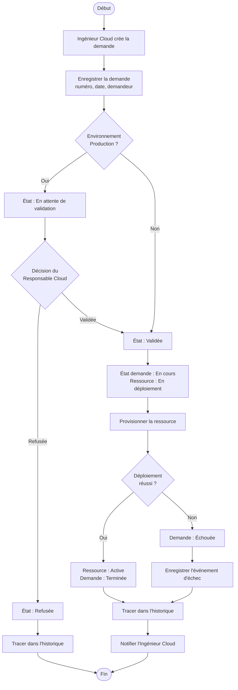

# Phase 2 – Élaboration : diagramme d'activité du processus de déploiement

```mermaid
flowchart TD
    A([Début]) --> B[Ingénieur Cloud crée la demande]
    B --> C[Enregistrer la demande<br/>numéro, date, demandeur]
    C --> D{Environnement<br/>Production ?}
    D -- Oui --> E[État : En attente de validation]
    E --> F{Décision du<br/>Responsable Cloud}
    F -- Refusée --> G[État : Refusée]
    G --> H[Tracer dans l'historique]
    H --> Z([Fin])
    F -- Validée --> I[État : Validée]
    D -- Non --> I
    I --> J[État demande : En cours<br/>Ressource : En déploiement]
    J --> K[Provisionner la ressource]
    K --> L{Déploiement<br/>réussi ?}
    L -- Oui --> M[Ressource : Active<br/>Demande : Terminée]
    L -- Non --> N[Demande : Échouée]
    N --> O[Enregistrer l'événement d'échec]
    M --> P[Tracer dans l'historique]
    O --> P
    P --> Q[Notifier l'Ingénieur Cloud]
    Q --> Z
```
